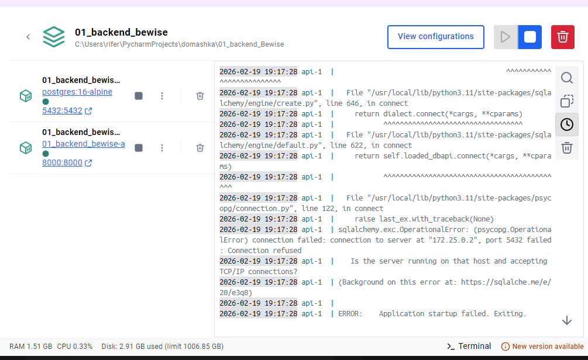
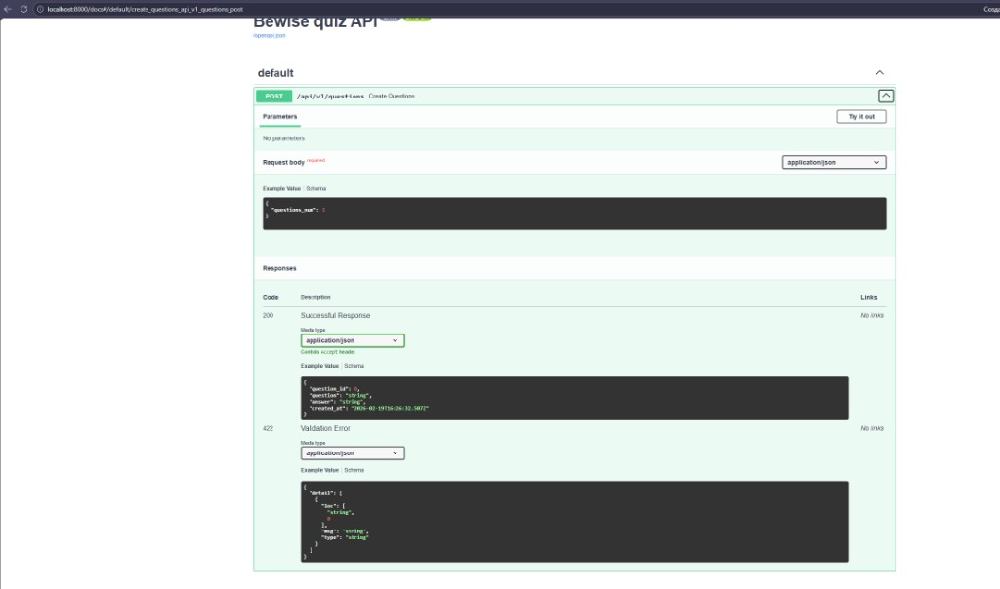
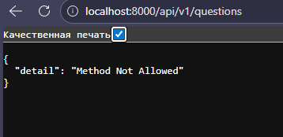

# Скриншоты

1. Запуск `docker compose up --build` (логи `api` и `db`).
   
2. Пример `POST /api/v1/questions` (curl) и ответ сервиса.
   
3. Swagger UI, документация эндпоинта Create Questions.
   
