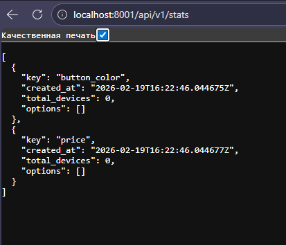
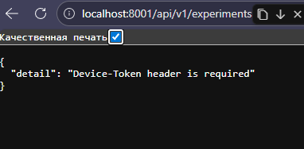
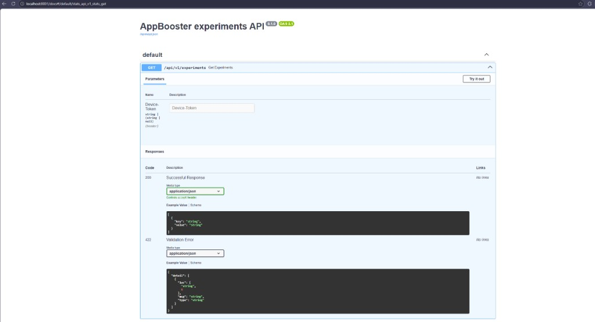
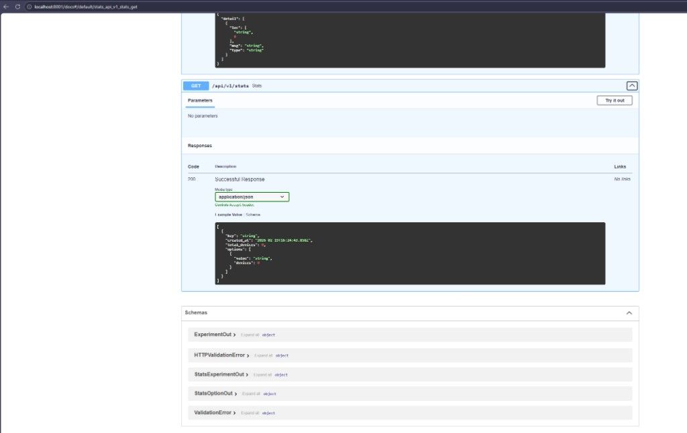

# Скриншоты

1. `docker compose up --build` (логи `api` и `db`).
   
2. Swagger: эндпоинт `GET /api/v1/experiments` с параметром Device-Token.
   
3. Swagger: эндпоинт `GET /api/v1/stats`.
   
4. Дополнительно.
   
