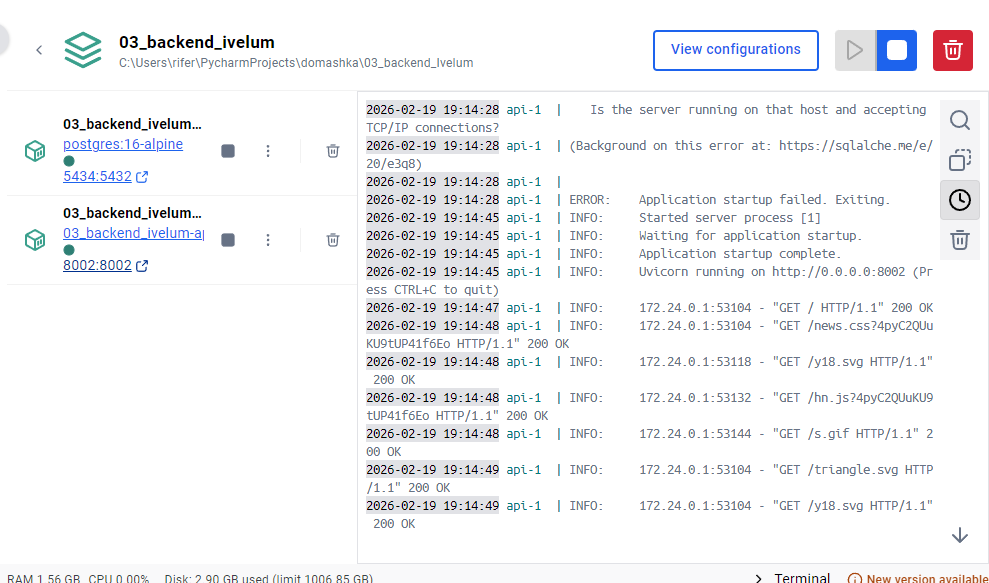
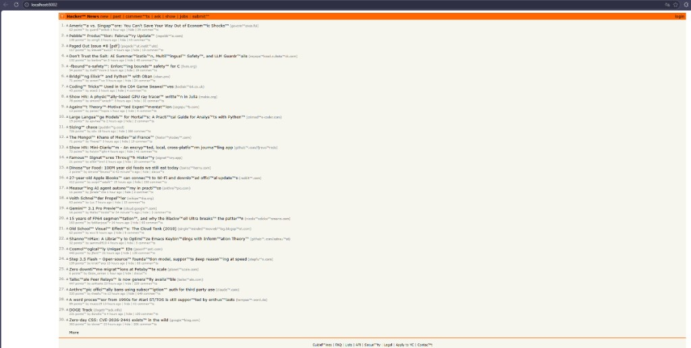

# Скриншоты

1. Запуск `docker compose up --build`.
   
2. Открытие в браузере `http://localhost:8002/` (главная HN через прокси).
   
3. Переход по ссылке внутри HN — адрес остаётся на `localhost`.
   
