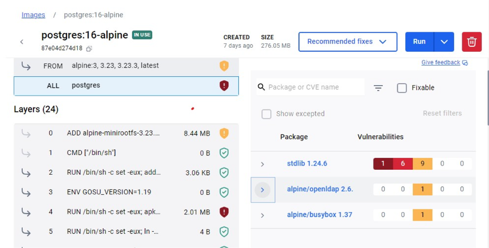
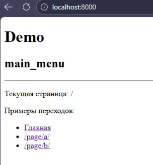
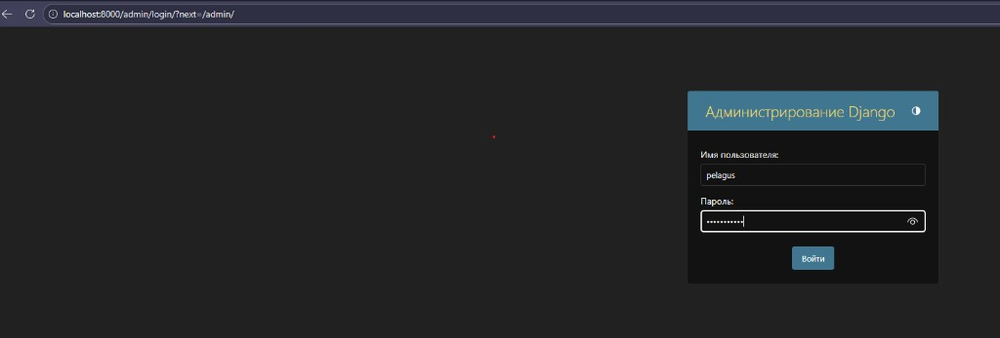
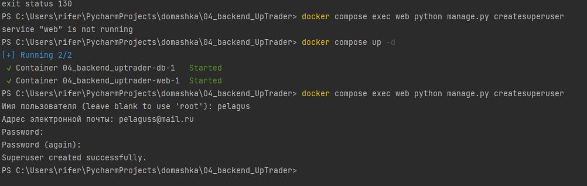
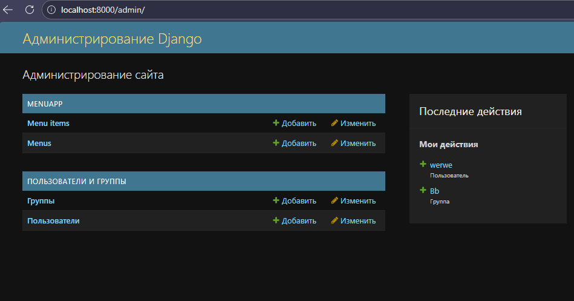

# Скриншоты

1. `docker compose up --build` (PostgreSQL и Django).
   
2. Создание суперпользователя, `docker compose up -d`.
   
3. Админка: создание меню и пунктов.
   
4. Страница с меню и демонстрация раскрытия активной ветки.
   
5. Демо-страница (main_menu, примеры переходов).
   
